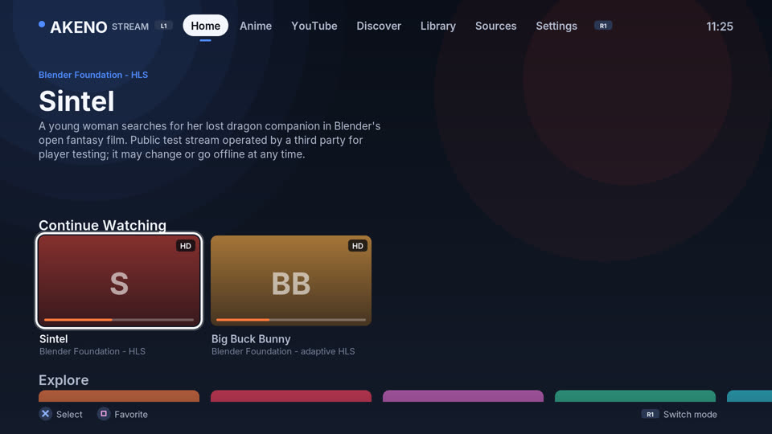
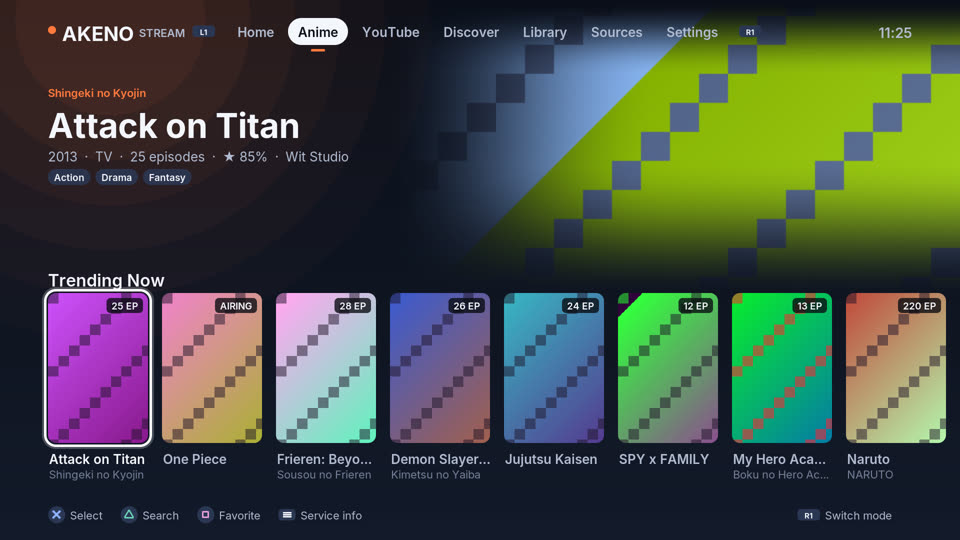
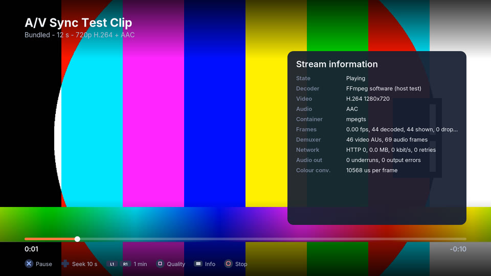
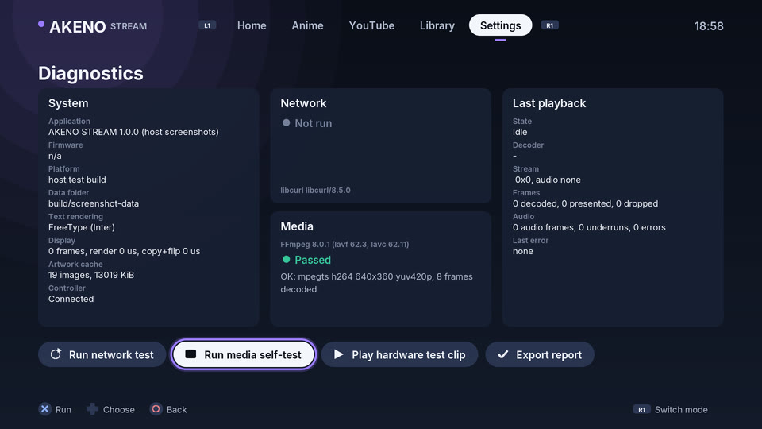

# AKENO STREAM for PS5

[](https://github.com/YTDxDAkeno/AKENO-ANIME-PS5/actions/workflows/tooling.yml)
[](LICENSE)

AKENO STREAM is a native, controller-operated media app for jailbroken PS5
consoles. It plays DRM-free video with audio - HLS streams, MPEG-TS over HTTP
and your own MP4, MKV, MOV and TS files - through the console's hardware video
decoder, and adds an anime discovery mode, a YouTube browser, a local library,
watch history, favourites and a diagnostics screen.

| | |
| --- | --- |
| Title ID | `PPSA99276` (unchanged since v0.1) |
| Version | 0.4.1 (`contentVersion` 01.004.001) |
| Target | Firmware 12.20 with ShadowMountPlus; no PSN account, no PC needed after install |
| Install path | `/data/homebrew/PPSA99276/` |
| Licence | GPL-3.0-or-later |

> **Read this first.** AKENO STREAM is compiled, linked and tested on a Linux
> build machine; it has **not yet run successfully on a PS5**. Earlier versions
> verified that the app launches (v0.1) and that HTTPS works (v0.2) on
> firmware 12.20; v0.3's video playback failed with `ERROR -51 / FRAMES 0`,
> and 0.4.0 crashed at launch (`CE-108255-1`) because the system heap returns
> null for real allocations. 0.4.1 brings its own heap and reports any crash
> as a notification naming the startup stage and code address - please send
> that text (a photo is fine). Then run the
> [hardware acceptance checklist](docs/HARDWARE_ACCEPTANCE.md).

German installation notes: [AKENO_INSTALLIEREN.md](AKENO_INSTALLIEREN.md).

| | |
| --- | --- |
|  |  |
|  |  |

*Rendered by the real interface code on the build machine (`make screenshots`)
with recorded API responses and generated placeholder artwork; more in
[docs/screenshots](docs/screenshots).*

## Feature status

"Host-tested" means automated tests on the build machine exercise the real
code path (with a local HTTP server, generated media and FFmpeg's software
decoder standing in for the console's hardware decoder). "PS5 build" means
the code compiles and links into `eboot.bin`. Nothing in 0.4.x is
hardware-verified yet.

| Feature | Status | Notes |
| --- | --- | --- |
| Launch, 1080p interface, DualSense navigation | Host-tested, PS5 build | Same VideoOut and pad sequence as the hardware-verified v0.1; new renderer and input mapper |
| Mode switching with L1/R1 (Home, Anime, YouTube, Library, Settings) | Host-tested, PS5 build | |
| HTTPS with certificate verification | Host-tested, PS5 build | Uses the console's CA list like the hardware-verified v0.2 |
| HLS playback (master playlists, variant choice, live streams, retries) | Host-tested, PS5 build | Clear MPEG-TS segments; see limitations |
| Hardware video decoding (H.264, HEVC; Videodec2) | PS5 build | ProsperoTV's shipping native backend |
| Audio (AAC via Audiodec; MP2; AC-3/E-AC-3 via FFmpeg) | PS5 build | Host tests cover demuxing, not console audio output |
| Local files: MP4, M4V, MKV, MOV, TS, M2TS | Host-tested, PS5 build | Remuxed on the fly to MPEG-TS by FFmpeg 8.0.1 |
| Pause, seek ±10 s / ±60 s, stop, replay, quality change | Host-tested, PS5 build | |
| Resume where you left off, history, favourites, settings | Host-tested, PS5 build | Stored in `/download0/akeno/` |
| Offline test clips (no network needed) | Host-tested, PS5 build | 2 s 360p clip and a 12 s 720p A/V sync clip |
| Public DRM-free test streams (Blender open movies, Apple, Akamai) | Host-tested with local copies | Third-party streams may go offline |
| Your own streams (`streams.json`) | Host-tested, PS5 build | |
| Anime mode: AniList catalogue, search, details, official links (QR) | Host-tested with recorded API responses | Discovery only - AniList has no video |
| YouTube: trending, search, channels (Data API v3, your key) | Host-tested with recorded API responses | **No YouTube playback** - see below |
| Crunchyroll | **Unsupported** | Status page explains why and lists legitimate options |
| Diagnostics: network test, media self-test, hardware test clip, report export | Host-tested, PS5 build | Reports exclude keys and tokens |
| USB drives in the library | PS5 build | Title sandbox access is unverified; the app reports what it can reach |
| Subtitles | Not implemented | |
| HDR | Not implemented | HDR streams play without tone mapping |

## Install

1. Download `PPSA99276.zip` from the latest successful
   [Build workflow run](https://github.com/YTDxDAkeno/AKENO-ANIME-PS5/actions/workflows/tooling.yml)
   (Artifacts section) and unzip it twice: the GitHub artifact ZIP contains
   `PPSA99276.zip`, which contains the `PPSA99276/` folder.
2. Copy the whole `PPSA99276/` folder over FTP to `/data/homebrew/PPSA99276/`
   (replace the files of an older version). Do not upload the ZIP itself.
3. If an old `/data/homebrew/PPSA99999/` from the v0.1 test is still on the
   console, delete it - it is an obsolete Hello World build.
4. Refresh ShadowMountPlus (or restart it) and start **AKENO STREAM**.

The folder contains `eboot.bin`, `sce_sys/` (param.json, icon, backgrounds),
`sce_module/libc.prx` and `assets/` (fonts and the offline test clips).

## Using the app

| Button | Everywhere | In the player |
| --- | --- | --- |
| L1 / R1 | Previous / next mode | Seek -60 s / +60 s |
| D-pad, left stick | Move | Left/right: seek -10 s / +10 s; up/down: volume |
| Cross | Select | Pause / play (replay at the end, retry after an error) |
| Circle | Back | Stop and close the player |
| Triangle | Search (Anime, YouTube) | Subtitles (shows "not available") |
| Square | Add / remove favourite | Change maximum quality (HLS) |
| OPTIONS | Service information | Stream information panel |

**First test:** Home -> *Offline Test Clips* -> *A/V Sync Test Clip*. It plays
from the app folder without network access: a test pattern with a beep once a
second. If you see the picture and hear the beeps in sync, hardware video and
audio work.

### Your own media

- **Files:** copy MP4, MKV, MOV or TS files to `/download0/akeno/media/` (the
  app's own storage; the folder is created when you first open *Library*) or a
  USB drive and open them in *Library*. `/download0` is limited to about 256 MB by `param.json`; use USB
  for larger files if the title sandbox allows access (the Library shows
  "No access from the title sandbox" otherwise).
- **Streams:** create `/download0/akeno/streams.json`:

  ```json
  {
    "streams": [
      { "title": "My HLS stream", "url": "https://example.com/live/master.m3u8", "live": true },
      { "title": "A TS file", "url": "https://example.com/video.ts", "type": "ts",
        "subtitle": "Optional", "description": "Optional", "image": "https://example.com/poster.jpg" }
    ]
  }
  ```

  `title` and an `http(s)` `url` are required; `type` is `hls` (default) or
  `ts`. Only add streams you are allowed to watch. The list appears in Home ->
  *Open Streams*.

### YouTube

YouTube mode uses the official YouTube Data API v3 with **your own free API
key** (Google Cloud Console -> enable "YouTube Data API v3" -> create an API
key). Enter it in YouTube mode or Settings with the on-screen keyboard, or put
it in `/download0/akeno/youtube-key.txt` and press Square; the file is deleted
after import. The key is stored in `/download0/akeno/secrets.json`, never
shown in logs or diagnostics reports. A search costs 100 of the default 10,000
daily quota units, a trending page 1 unit.

YouTube's terms allow playback only in YouTube's own players. AKENO STREAM
does not extract stream URLs; each video shows a QR code to open it on your
phone. Sign-in (Google OAuth for TV devices) would need a registered client ID
and is not part of this build.

### Anime mode and Crunchyroll

Anime mode shows trending, seasonal, popular and top-rated anime from the
public [AniList](https://anilist.co) API with descriptions, episode counts,
trailers and the official streaming sites for each title (as QR codes).
AniList provides no video, and AKENO STREAM does not scrape video sites.

Crunchyroll has no public API, its sign-in is for its own apps, and its
streams are DRM-protected (Widevine/PlayReady). Integrating it would require
circumventing that protection, which this project will not do. Use the
official Crunchyroll app on PS5. The *Crunchyroll* card on Home explains this
in the app. Open animated films (Blender Foundation, CC BY) are playable in
Anime mode.

### If the app crashes

0.4.1 shows its startup steps on screen ("Loading fonts...", "Starting
network...") and catches crashes: before the system's error dialog appears,
a notification reads for example *"AKENO STREAM 0.4.1 crashed: SIGSEGV (invalid
memory access) at eboot+0x1a2b3c, address 0x0, during startup: fonts"*. The
same text with a backtrace is written to `/download0/akeno/crash.txt`. The
`eboot+0x…` offsets map to source lines with the `build/llvm-pie.elf` of the
same build (CI uploads it with the screenshots).

### Diagnostics

Settings -> *Diagnostics* shows system, network, media and last-playback
information and can run a network test, an FFmpeg media self-test and the
hardware test clip. *Export report* writes
`/download0/akeno/akeno-diagnostics-YYYYMMDD-HHMMSS.txt`; fetch it over FTP
and attach it to bug reports. API keys, tokens and signed URL parameters are
redacted.

## Limitations

- HLS: clear (unencrypted) MPEG-TS segments only. Encrypted (AES-128,
  SAMPLE-AES, DRM), fMP4/CMAF (`EXT-X-MAP`) and byte-range playlists are
  refused with a message. Variants whose audio is only in a separate
  rendition play without sound when no muxed variant exists.
- MP3 audio inside MPEG-TS is not supported (the stream plays without audio
  with a notice); MP2 is.
- Video: H.264 and HEVC (8/10-bit 4:2:0). VP9/AV1 are not supported.
- No subtitles, no HDR tone mapping, no picture-in-picture, no download
  manager.
- Third-party test streams can disappear at any time.
- USB access from inside the title sandbox has not been confirmed on 12.20.

## Building from source

Linux or WSL with Clang 18, lld 18, Ninja, Python 3, pkg-config and (for the
tests) FFmpeg's command-line tools, FreeType and libcurl development files:

```sh
sudo apt-get install clang-18 lld-18 clang-format-18 libclang-rt-18-dev ninja-build ccache \
  pkg-config python3 ffmpeg libfreetype-dev libcurl4-openssl-dev
make            # PS5 build: dist/PPSA99276/ and dist/PPSA99276.zip
make test-unit  # 64 host tests (ASan/UBSan), local HTTP server, generated media
make screenshots  # renders every screen to build/screenshots/*.png
make lint
```

The first build downloads and verifies the public PS5 payload SDK, PacBrew's
prebuilt libcurl/OpenSSL/FreeType and FFmpeg 8.0.1's source (built twice: for
the PS5 and for the host tests) into the ignored `.deps/` folder. `make app`
also runs `tools/check-imports.py`, which fails the build if any import would
bind to a system module that does not work in native titles. The GitHub
workflow runs all of this and uploads the ZIP, screenshots and import table.

See [docs/ARCHITECTURE.md](docs/ARCHITECTURE.md) for how the app is put
together, [docs/V03_ROOT_CAUSE.md](docs/V03_ROOT_CAUSE.md) for the analysis of
the v0.3 playback failure and [docs/BOILERPLATE.md](docs/BOILERPLATE.md) for
the underlying build tooling.

## Credits and licences

AKENO STREAM is GPL-3.0-or-later. It builds on
[ps5-native-app-boilerplate](https://github.com/blackbearreloaded/ps5-native-app-boilerplate)
(GPL-3.0-or-later) and vendors the native TS demuxer and Videodec2/Audiodec
backend of [ProsperoTV](https://github.com/blackbearreloaded/ProsperoTV)
(GPL-3.0-or-later). It uses FFmpeg (LGPL-2.1-or-later), libcurl, OpenSSL,
FreeType, the Inter typeface (SIL OFL 1.1), stb_image, qrcodegen and minimp3.
Catalogue data comes from AniList and the YouTube Data API under their terms.
Full notices: [THIRD_PARTY_NOTICES.md](THIRD_PARTY_NOTICES.md).

This project is not affiliated with Sony, Crunchyroll, Google/YouTube or
AniList.
