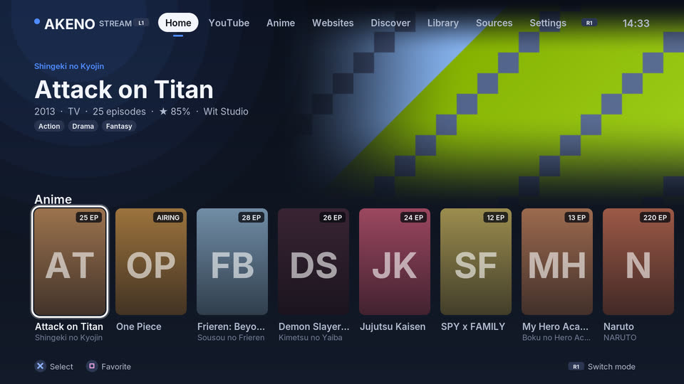
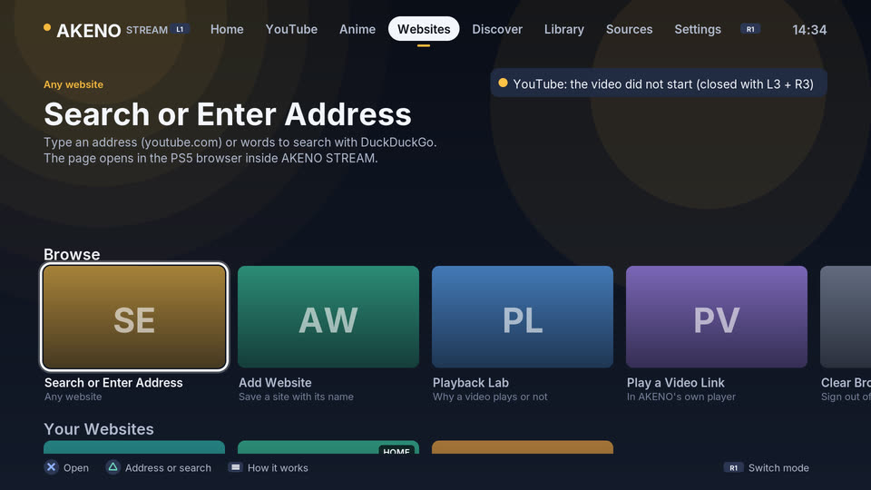
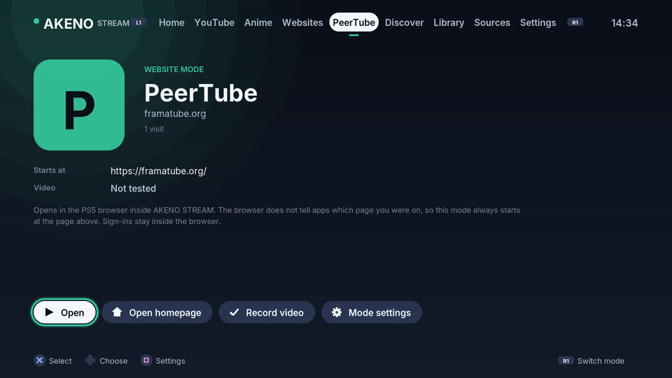
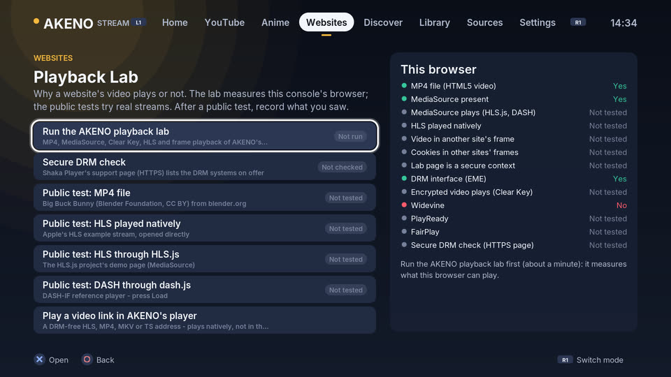
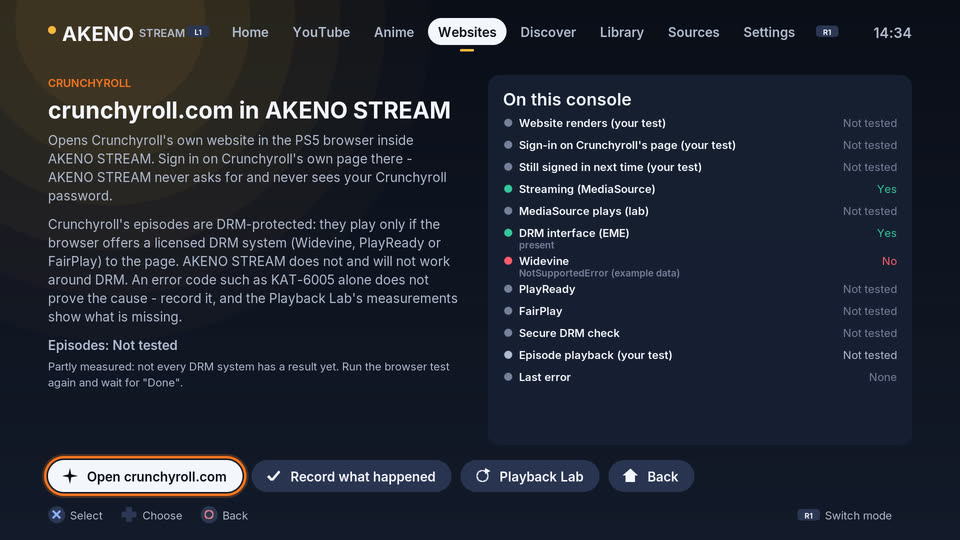
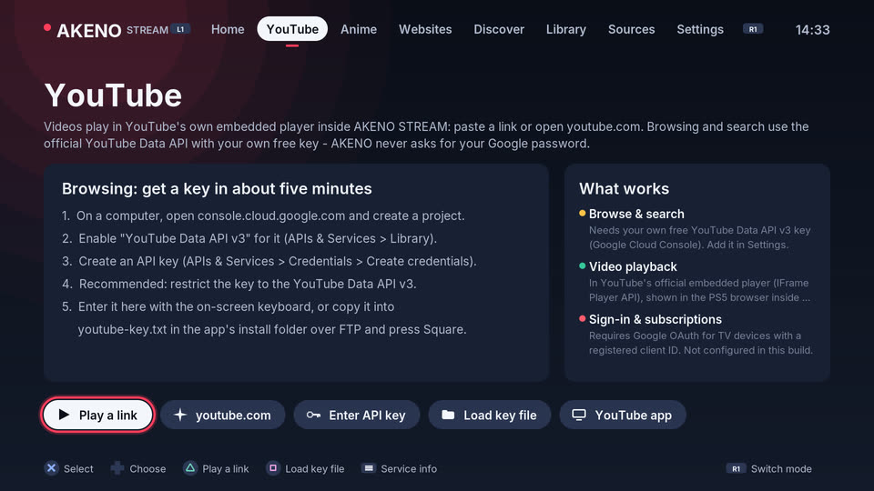
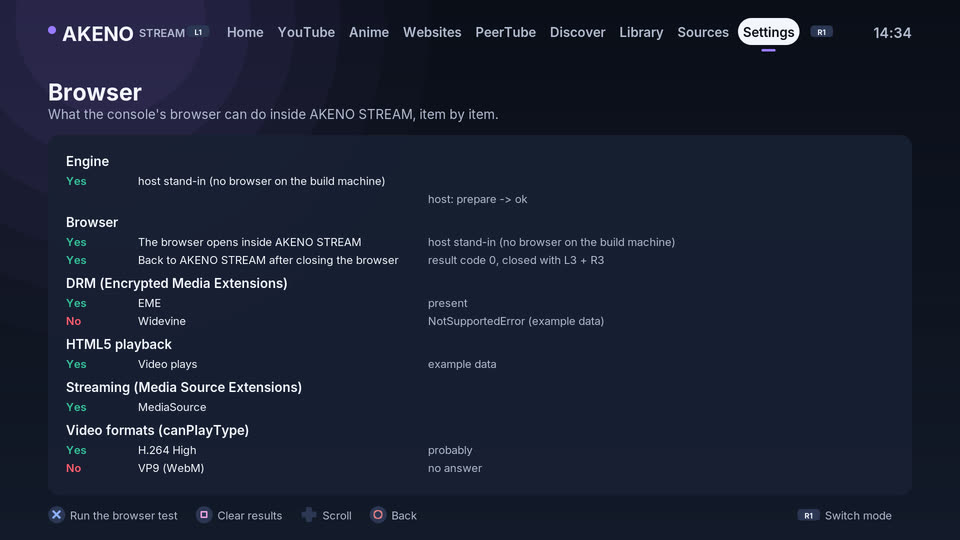
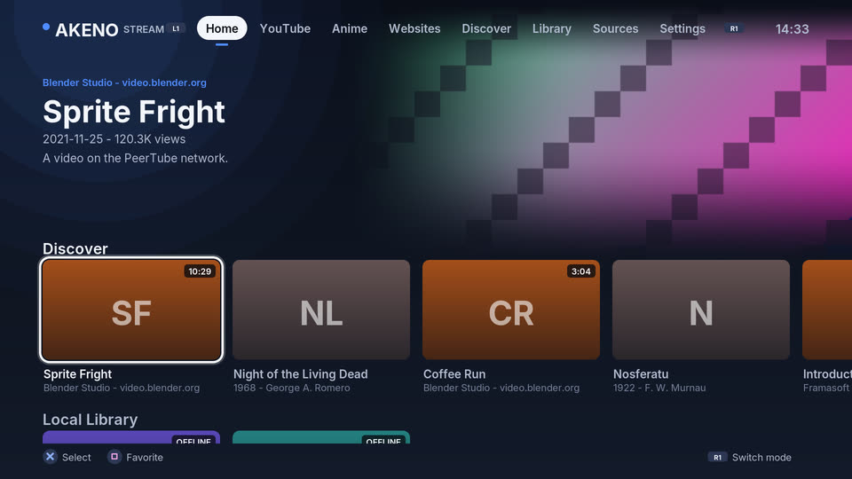

# AKENO STREAM for PS5

[](https://github.com/YTDxDAkeno/AKENO-ANIME-PS5/actions/workflows/tooling.yml)
[](LICENSE)

AKENO STREAM is a native, controller-operated media app for jailbroken PS5
consoles. It plays DRM-free video with audio - HLS streams (MPEG-TS or
fragmented MP4), MPEG-TS over HTTP, MP4/MKV files on web servers and your own
MP4, MKV, MOV and TS files - through the console's hardware video decoder.
**Websites** opens any website you add in the PS5's own browser engine
*inside* the app; **YouTube** plays in YouTube's official embedded player;
**Crunchyroll** opens its real website with its own sign-in. **Discover**
plays free video from PeerTube and public-domain films from the Internet
Archive; **Sources** takes your own M3U lists, JSON feeds and stream addresses
(also from your phone); the app adds an anime discovery mode, a local
library, watch history, favourites and a diagnostics screen.

| | |
| --- | --- |
| Title ID | `PPSA99276` (unchanged since v0.1) |
| Version | 1.0.0 (`contentVersion` 01.100.000); first release candidate `v1.0.0-rc.1` |
| Tested on | PS5 firmware 12.20 (builds before 1.0.0: browser, YouTube, PeerTube, websites) and 13.09 with ShadowMountPlus (0.4.1); no PSN account, no PC needed after install |
| Install path | `/data/homebrew/PPSA99276/` |
| Licence | GPL-3.0-or-later |

> **Status: 1.0.0 release candidate.** On a jailbroken PS5 with firmware
> 12.20, the build before 1.0.0 launched, DualSense navigation worked, native HLS played,
> PeerTube videos played with picture and sound, YouTube videos played in the
> embedded browser, user-entered websites opened, and Crunchyroll's website
> loaded with a working sign-in. Crunchyroll *episodes* stop with error
> **KAT-6005** and AnikotoTV's player loads but never starts - see
> *Known limitations*. 1.0.0 adds the redesigned Home, websites as their own
> app modes and the Playback Lab (which now also plays an encrypted clip with
> Clear Key to tell "no DRM system" apart from "no decryption at all"); these
> are host-tested and build for the PS5, and need their console run with the
> [hardware acceptance checklist](docs/HARDWARE_ACCEPTANCE.md) (section 11)
> before 1.0.0 is published as stable. What changed: [CHANGELOG.md](CHANGELOG.md).

German installation notes: [AKENO_INSTALLIEREN.md](AKENO_INSTALLIEREN.md).

| | |
| --- | --- |
|  |  |
|  |  |
|  |  |
|  |  |
|  |  |
|  |  |
|  |  |
|  |  |

*Rendered by the real interface code on the build machine (`make screenshots`)
with recorded API responses and generated placeholder artwork; more in
[docs/screenshots](docs/screenshots).*

## Feature status

**Console** = seen working on a PS5 (firmware 13.09 with 0.4.1, or firmware
12.20 with a build before 1.0.0 where marked).
**Host-tested** = automated tests on the build machine exercise the real code
path (local HTTP server, generated media, FFmpeg's software decoder standing
in for the console's hardware decoder). **PS5 build** = compiled and linked
into `eboot.bin`, not yet tried on the console.

| Feature | Status | Notes |
| --- | --- | --- |
| Launch, 1080p interface, Inter fonts, DualSense navigation | **Console** (also fw 12.20) | |
| Mode switching with L1/R1 (Home, YouTube, Anime, Websites, website modes, Discover, Library, Sources, Settings) | **Console** (Discover new in 0.6.0, Websites new in 0.7.0) | The last mode, a website mode included, is restored at the next start |
| Home: Continue Watching, YouTube, Anime, My Websites, Discover, Local Library, Recently Added Websites, Favorites | Host-tested, PS5 build | New in 1.0.0; empty rows are hidden; online rows fill in after Home is shown |
| Websites as app modes: own tab, name, icon or letter tile, colour, start page (at most four) | Host-tested (controller-driven), PS5 build | New in 1.0.0; still the system browser - a shortcut with a home, not a native integration |
| Playback Lab: MP4, fragmented MP4 through MediaSource, Clear Key-encrypted video through EME, native HLS, cross-origin frame, DRM key systems, full screen, audio, codec support | Host-tested; lab page run in desktop Chromium; PS5 build | New in 1.0.0 (Clear Key step new in rc.1); per-site records classified into eight states |
| Embedded browser: websites inside AKENO STREAM (`libSceWebBrowserDialog`) | **Console** (fw 12.20) | The system's WebKit browser over the app; see [docs/WEBSITES.md](docs/WEBSITES.md) |
| Websites: add, edit, remove, pin to Home, private, icons, recently visited, address bar with search, `websites.txt` | Opening user-entered sites: **Console** (fw 12.20); rest host-tested | No allow-list; http/https only |
| YouTube: official embedded player (IFrame Player API), playlists, full screen, per-capability results | **Console** (fw 12.20: videos play) | Works without an API key (links) |
| Crunchyroll: real website with its own sign-in, DRM verdict from measurements | Website and sign-in **Console** (fw 12.20); episodes fail with KAT-6005 | Protected episodes play only if the browser offers a DRM system to pages - never bypassed |
| Browser capability test (codecs, MSE, EME/DRM, storage persistence, HTML5 playback with sound) | Host-tested, PS5 build | Now part of the Playback Lab; results saved per item and in the diagnostics report |
| HTTPS with certificate verification | **Console** | Console CA list; example.com and mux.dev answered |
| HLS playback (MPEG-TS segments) | **Console** | Big Buck Bunny played; resume position saved |
| HLS with fMP4/CMAF segments (`EXT-X-MAP`) | Host-tested, PS5 build | New in 0.5.0; remuxed by FFmpeg to MPEG-TS for the hardware pipeline |
| HLS with a separate audio rendition (`EXT-X-MEDIA`) | Host-tested, PS5 build | New in 0.5.0; video and audio playlists are merged by time |
| HLS with AES-128 segment encryption, byte ranges | Host-tested, PS5 build | New in 0.5.0; the standard HLS method, not DRM. SAMPLE-AES/FairPlay/Widevine/PlayReady are refused |
| MP4, MKV, MOV and TS files on web servers | Host-tested, PS5 build | New in 0.5.0; seeking with HTTP range requests (also works, slower, without them) |
| Sources: M3U/M3U8 lists, AKENO JSON feeds, stream addresses you add | Host-tested, PS5 build; tester reports 0.5.0 works | See [docs/SOURCES.md](docs/SOURCES.md). The app ships no sources |
| Add sources from a phone (QR code, page on the local network) | Host-tested, PS5 build | New in 0.6.0; works only while the screen is open, with a one-time code |
| Discover: PeerTube (Sepia Search, instance API) with in-app playback | **Console** (fw 12.20: picture and sound) | New in 0.6.0 |
| Discover: Internet Archive public-domain films and cartoons with in-app playback | Host-tested (recorded responses, local playback test), PS5 build | New in 0.6.0; curated collections only |
| Hardware H.264 decoding (Videodec2) | **Console** | 720p30 clip: 360/360 frames presented, 0 dropped, 0 decoder errors |
| Hardware HEVC decoding | PS5 build | |
| AAC audio (Audiodec + AudioOut) | **Console** | 0 underruns, 0 output errors; A/V sync by eye not yet reported |
| MP2, AC-3/E-AC-3 audio | PS5 build | |
| Local files: MP4, M4V, MKV, MOV, TS, M2TS | Host-tested, PS5 build | Remuxed on the fly to MPEG-TS by FFmpeg 8.0.1 |
| Stop, pause, seek ±10 s / ±60 s, replay, quality change | Stop: **Console**; rest host-tested | |
| Resume where you left off, history, favourites, settings | **Console** | Files written on the console |
| Offline test clips (no network needed) | **Console** | 2 s 360p clip and a 12 s 720p A/V sync clip |
| Public DRM-free test streams | Big Buck Bunny **Console** | Third-party streams may go offline |
| Your own streams (`streams.json`) | Host-tested, PS5 build | Still read; Sources is the more flexible way |
| Anime mode: AniList catalogue, search, details, official links (QR) | **Console** (catalogue and artwork loaded) | Discovery only - AniList has no video |
| YouTube: trending, search, channels (Data API v3, your key) | Host-tested, PS5 build | Playback in the official embedded player (above) |
| YouTube: open the official YouTube app | PS5 build (experimental, secondary) | 0.6.0's run-time lookup most likely fails in a homebrew title (see [BROWSER_RESEARCH.md](docs/BROWSER_RESEARCH.md)); the external-browser hand-off was removed in 0.7.0 |
| Diagnostics: network test, FFmpeg self-test, report export | **Console** | Reports exclude keys and tokens |
| Crash reporter, previous-crash notice | PS5 build | No crash since 0.4.1 to test it with |
| On-screen keyboard with symbols, secret masking | Host-tested, PS5 build | 0.4.3 fixed the crash while typing a key (seen on the console with 0.4.2); long addresses scroll to the cursor |
| USB drives in the library | PS5 build | Title sandbox access is unverified; the app reports what it can reach |
| Subtitles | Not implemented | |
| HDR | Not implemented | HDR streams play without tone mapping |

## Install

1. Download `AKENO-STREAM-PS5-<version>.zip` from
   [Releases](https://github.com/YTDxDAkeno/AKENO-ANIME-PS5/releases) and check
   it against the release's `SHA256SUMS` (`sha256sum -c SHA256SUMS`), then
   unzip it: it contains the `PPSA99276/` folder. Release candidates
   (`-rc.N`) are marked as pre-releases. Development builds: download
   `PPSA99276.zip` from a successful
   [Build workflow run](https://github.com/YTDxDAkeno/AKENO-ANIME-PS5/actions/workflows/tooling.yml)
   (Artifacts section) and unzip it twice: the GitHub artifact ZIP contains
   `PPSA99276.zip`, which contains the `PPSA99276/` folder.
2. Copy the whole `PPSA99276/` folder over FTP to `/data/homebrew/PPSA99276/`
   (replace the files of an older version). Do not upload the ZIP itself.
3. If an old `/data/homebrew/PPSA99999/` from the v0.1 test is still on the
   console, delete it - it is an obsolete Hello World build.
4. Refresh ShadowMountPlus (or restart it) and start **AKENO STREAM**.

The folder contains `eboot.bin`, `sce_sys/` (param.json, icon, backgrounds),
`sce_module/libc.prx`, `assets/` (fonts and the offline test clips) and
`sources-example.txt` (a template, see *Sources* below).

## Using the app

| Button | Everywhere | In the player |
| --- | --- | --- |
| L1 / R1 | Previous / next mode | Seek -60 s / +60 s |
| D-pad, left stick | Move | Left/right: seek -10 s / +10 s; up/down: volume |
| Cross | Select | Pause / play (replay at the end, retry after an error) |
| Circle | Back | Stop and close the player |
| Triangle | Search (Anime, YouTube, Discover, inside a source); Websites: address or search | Subtitles (shows "not available") |
| Square | Add / remove favourite (Sources: remove a source; Websites: options) | Change maximum quality (HLS) |
| OPTIONS | Service information | Stream information panel |

**First test:** Home -> *Local Library* -> *A/V Sync Test Clip*. It plays
from the app folder without network access: a test pattern with a seconds
counter and a beep once a second. If you see the picture and hear the beeps in
sync, hardware video and audio work.

### Where files go

Over FTP a PC can **write** only to the install folder
`/data/homebrew/PPSA99276/` (the app sees it as `/app0`). The app's own data
folder (`/download0/akeno` inside the app) can only be **read** from a PC, and
only while AKENO STREAM is running, at
`/mnt/sandbox/PPSA99276_000/download0/akeno/`. When the app is closed, that
data lives in the image `/user/download/PPSA99276/download0.dat` (readable
with [UFS2Tool](https://github.com/SvenGDK/UFS2Tool)).

| What | Copy to (from a PC) |
| --- | --- |
| Your video files | `/data/homebrew/PPSA99276/media/` |
| Your sources | `/data/homebrew/PPSA99276/sources.txt` (or `sources.json`) |
| Your stream list (older format) | `/data/homebrew/PPSA99276/streams.json` |
| YouTube API key (optional) | `/data/homebrew/PPSA99276/youtube-key.txt` |
| Websites to add (optional) | `/data/homebrew/PPSA99276/websites.txt` (`Name = https://…` per line, imported once) |

| What | Read from (while the app runs) |
| --- | --- |
| Diagnostics reports, `crash-previous.txt` | `/mnt/sandbox/PPSA99276_000/download0/akeno/` |

Files in the install folder are kept when you update the app by copying the
new `PPSA99276/` folder over the old one.

### Your own media

- **Files:** copy MP4, MKV, MOV or TS files to
  `/data/homebrew/PPSA99276/media/` and open them in *Library* -> *Media in
  the install folder*. USB drives are listed too; the Library shows "No access
  from the title sandbox" if the console does not let the app read them.
- **Streams:** create `/data/homebrew/PPSA99276/streams.json`:

  ```json
  {
    "streams": [
      { "title": "My HLS stream", "url": "https://example.com/live/master.m3u8", "live": true },
      { "title": "A TS file", "url": "https://example.com/video.ts", "type": "ts",
        "subtitle": "Optional", "description": "Optional", "image": "https://example.com/poster.jpg" }
    ]
  }
  ```

  `title` and an `http(s)` `url` are required; `type` is `hls` (default) or
  `ts`. Only add streams you are allowed to watch. The list appears in Home ->
  *Discover* -> *Open Streams*.

### Sources (your own lists, feeds and addresses)

The **Sources** mode lets you add what you want to watch; the app itself ships
no sources and does not look for any. You decide what to add and you are
responsible for having the right to watch it.

- **From your phone:** Sources -> *Add from Phone* shows a QR code. Scan it
  with a phone on the same network, paste the address, tap *Add to the PS5*.
  The page works only while that screen is open and only with its one-time
  code.
- **On the console:** Sources -> *Add a Source*, type the address (the keyboard
  has a symbols page on R1 for `:/?=&`), then a name. *Play an Address* plays a
  link once without saving it.
- **From a PC (easier):** put `sources.txt` into
  `/data/homebrew/PPSA99276/` (start from the packaged `sources-example.txt`),
  one source per line:

  ```text
  # Name = address
  My TV list = https://example.com/lists/tv.m3u
  Club videos = https://example.com/feeds/club.json
  https://example.com/live/stream.m3u8
  ```

A source can be an **M3U/M3U8 list** (entries grouped by `group-title`, logos
from `tvg-logo`), an **AKENO JSON feed**, an **HLS playlist**, an **MPEG-TS
stream** or an **MP4/MKV file**. Open a source to browse it, Triangle searches
inside it. DRM-protected entries, MPEG-DASH (`.mpd`) and non-HTTP protocols
(rtmp, udp) are skipped with a note. Nothing is read out of web pages and no
site protection is bypassed. Details and the feed format:
[docs/SOURCES.md](docs/SOURCES.md).

### Discover: PeerTube and the Internet Archive

**Discover** shows free video that plays right in the app:

- **PeerTube**, the open, federated video platform: latest videos, films,
  art & animation, science and kids' rows from
  [Sepia Search](https://sepiasearch.org) (the PeerTube search index, with
  sensitive content excluded) and channels of a few well-known instances
  (Blender Studio's open movies, Framatube, TILvids). Videos stream from
  their instance as HLS or MP4 without DRM.
- **Internet Archive**: Feature Films (films the archive believes to be in
  the public domain), classic cartoons up to 1963, silent films and the
  Prelinger Archives, through the archive's documented search and metadata
  APIs. Only curated collections are listed, not arbitrary uploads.

Triangle searches both at once. Open an entry for details, then *Play*.

### YouTube

YouTube mode uses the official YouTube Data API v3 with **your own free API
key** (Google Cloud Console -> enable "YouTube Data API v3" -> create an API
key). Enter it in YouTube mode or Settings with the on-screen keyboard, or put
it in `/data/homebrew/PPSA99276/youtube-key.txt`: the app imports it at the
next start (or when you press Square in YouTube mode); delete the file
afterwards (the app cannot delete files in its install folder). The key is stored in the app's data folder (`secrets.json`), never
shown in logs or diagnostics reports. A search costs 100 of the default 10,000
daily quota units, a trending page 1 unit.

YouTube's terms allow playback only in YouTube's own players, and AKENO
STREAM does not extract stream URLs. Videos play in **YouTube's
official embedded player** (IFrame Player API) in the console's browser
inside AKENO STREAM: a video's details offer **Play**, a channel **Play
uploads** (a playlist), and without an API key YouTube mode offers **Play a
link** and **youtube.com** (the full site, sign-in on Google's own page). The
player page has large TV buttons (Back to AKENO, Previous, Play/Pause, Next,
Full screen, Mute) and reports what happened item by item - including the
meaning of YouTube's error codes, for example 101/150 when a video's owner
does not allow embedding. Details: [docs/WEBSITES.md](docs/WEBSITES.md).
The *YouTube App* card (starting the separately installed app) remains as a
secondary, experimental option.
Sign-in to YouTube inside AKENO's own pages (Google OAuth for TV devices)
would need a registered client ID and is not part of this build.

### Websites

**Websites** (between YouTube and Discover) is a TV front page for the
console's own browser engine, shown inside AKENO STREAM: an address bar
(Triangle: an address opens, other text is searched for), *Add Website* with
the on-screen keyboard, your saved websites with their icons, *Recently
Visited*, and the *Playback Lab* that measures what plays and why. Square on
a website renames it, changes its address, saves it to Home (*My Websites*),
**pins it as a mode** (its own tab after Websites, with a tab name, its icon
or a letter tile, a colour and a start page; at most four), makes it
private, records what works or removes it. There is no list of allowed sites - you decide
what to open and are responsible for using it lawfully. From a PC, put
`websites.txt` (`Name = https://…` per line) into the install folder.

Inside the browser, the browser's own controls apply (cursor, scrolling,
back/forward, the system keyboard); close the browser to return. **Avoid the
PS button while the browser is open**; if it offers no way out, press L3 and
R3 together. Sign-ins stay inside the browser - AKENO STREAM never sees
passwords, cookies or what you type. Full guide and security model:
[docs/WEBSITES.md](docs/WEBSITES.md); research and evidence:
[docs/BROWSER_RESEARCH.md](docs/BROWSER_RESEARCH.md).

### Anime mode and Crunchyroll

Anime mode shows trending, seasonal, popular and top-rated anime from the
public [AniList](https://anilist.co) API with descriptions, episode counts,
trailers and the official streaming sites for each title (as QR codes).
AniList provides no video, and AKENO STREAM does not scrape video sites.

The **Crunchyroll** section (Home's Anime row, Anime -> Streaming Services, Websites)
opens Crunchyroll's own website in the browser inside AKENO STREAM. Sign in
on Crunchyroll's own page - AKENO never shows a login form. Crunchyroll's
episodes are DRM-protected (Widevine/PlayReady/FairPlay): they play only if
the console's browser offers such a DRM system to web pages, which the
browser test measures; the section states the measured verdict and lets you
record, item by item, whether the site renders, sign-in works, the session
is kept, the player starts and an episode plays. DRM is never circumvented.
Open animated films (Blender Foundation, CC BY) are playable in Anime mode.

### If the app crashes

The app shows its startup steps on screen ("Loading fonts...", "Starting
network...") and catches crashes: before the system's error dialog appears,
a notification reads for example *"AKENO STREAM 1.0.0 crashed: SIGSEGV (invalid
memory access) at eboot+0x1a2b3c, address 0x0, during startup: fonts"*. A
photo of it is the most useful bug report. At the next start the app says that
the last session crashed, lists the first line under Settings -> Diagnostics
and keeps the full text with a backtrace as `crash-previous.txt` in its data
folder. The `eboot+0x…` offsets map to functions with the `build/llvm-pie.elf`
of the same build (CI uploads it with the screenshots).

### Diagnostics

Settings -> *Diagnostics* shows system, network, media and last-playback
information and can run a network test, an FFmpeg media self-test and the
hardware test clip. *Export report* writes
`akeno-diagnostics-YYYYMMDD-HHMMSS.txt` to the app's data folder; while the
app is still running, fetch it over FTP from
`/mnt/sandbox/PPSA99276_000/download0/akeno/` and attach it to bug reports. API keys, tokens and signed URL parameters are
redacted.

## Limitations

- HLS: MPEG-TS and fragmented-MP4 segments, byte ranges, separate audio
  renditions and AES-128. SAMPLE-AES and every DRM system (FairPlay,
  Widevine, PlayReady) are refused with a message - DRM is not circumvented.
  Packed-audio renditions (raw `.aac` segments) carry no timestamps the app
  reads, so their sync is not guaranteed. The first audio rendition chosen
  (default > autoselect > first) is used; there is no audio-track menu yet.
- MPEG-DASH (`.mpd`) is not supported.
- Sources never search web pages for videos: a source must be a list, feed,
  playlist or media address, and no site-specific extractors will be added.
  Websites play their videos in their own web players in the browser
  (Websites mode), as far as the console's browser supports them.
- The browser is the system's dialog: AKENO cannot draw over it, control
  navigation inside it or read its cookies, and cannot tell which page was
  open when it closed (a website mode always starts at its start page).
  *Clear Browser Data* asks the system to forget all cookies; firmwares
  without that function only lose this option.
- DRM-protected web video (Crunchyroll episodes and similar) plays only if the
  console's browser offers a DRM system to web pages; AKENO measures this but
  cannot add one, and never bypasses it. On firmware 12.20 Crunchyroll
  episodes stop with **KAT-6005** while the site and sign-in work; run the
  Playback Lab and the secure DRM check, then record the episode result in
  the Crunchyroll section - it names the measured cause.
- Some sites' players load but never start (seen with AnikotoTV on firmware
  12.20). Typical causes are a player that refuses this browser, a video host
  that forbids playback inside other sites' frames, or a missing streaming
  feature; record it with *Record video playback* and compare with the
  Playback Lab. AKENO adds no site-specific extractors.
- MP3 audio inside MPEG-TS is not supported (the stream plays without audio
  with a notice); MP2 is.
- Video: H.264 and HEVC (8/10-bit 4:2:0). VP9/AV1 are not supported.
- No subtitles, no HDR tone mapping, no picture-in-picture, no download
  manager.
- Third-party test streams can disappear at any time.
- USB access from inside the title sandbox has not been confirmed on the
  console (firmware 13.09).

## Building from source

Linux or WSL with Clang 18, lld 18, Ninja, Python 3, pkg-config and (for the
tests) FFmpeg's command-line tools, FreeType and libcurl development files:

```sh
sudo apt-get install clang-18 lld-18 clang-format-18 libclang-rt-18-dev ninja-build ccache \
  pkg-config python3 ffmpeg libfreetype-dev libcurl4-openssl-dev
make            # PS5 build: dist/PPSA99276/ and dist/PPSA99276.zip
make test-unit  # 166 host tests (ASan/UBSan), local HTTP server, generated media, browser stand-in
make screenshots  # renders every screen to build/screenshots/*.png
make lint
```

The first build downloads and verifies the public PS5 payload SDK, PacBrew's
prebuilt libcurl/OpenSSL/FreeType and FFmpeg 8.0.1's source (built twice: for
the PS5 and for the host tests) into the ignored `.deps/` folder. `make app`
also runs `tools/check-imports.py`, which fails the build if any import would
bind to a system module that does not work in native titles. The GitHub
workflow runs all of this and uploads the ZIP, screenshots and import table.

See [docs/ARCHITECTURE.md](docs/ARCHITECTURE.md) for how the app is put
together, [docs/V03_ROOT_CAUSE.md](docs/V03_ROOT_CAUSE.md) for the analysis of
the v0.3 playback failure and [docs/BOILERPLATE.md](docs/BOILERPLATE.md) for
the underlying build tooling.

## Credits and licences

AKENO STREAM is GPL-3.0-or-later. It builds on
[ps5-native-app-boilerplate](https://github.com/blackbearreloaded/ps5-native-app-boilerplate)
(GPL-3.0-or-later) and vendors the native TS demuxer and Videodec2/Audiodec
backend of [ProsperoTV](https://github.com/blackbearreloaded/ProsperoTV)
(GPL-3.0-or-later). It uses FFmpeg (LGPL-2.1-or-later), libcurl, OpenSSL,
FreeType, the Inter typeface (SIL OFL 1.1), stb_image, qrcodegen and minimp3.
Catalogue data comes from AniList and the YouTube Data API under their terms.
Full notices: [THIRD_PARTY_NOTICES.md](THIRD_PARTY_NOTICES.md).

This project is not affiliated with Sony, Crunchyroll, Google/YouTube or
AniList. The embedded browser is the console's own; its interface layouts come
from SharpProspero and EVO-PLAYER-PS5 (GPL-3.0), credited in
[THIRD_PARTY_NOTICES.md](THIRD_PARTY_NOTICES.md).
